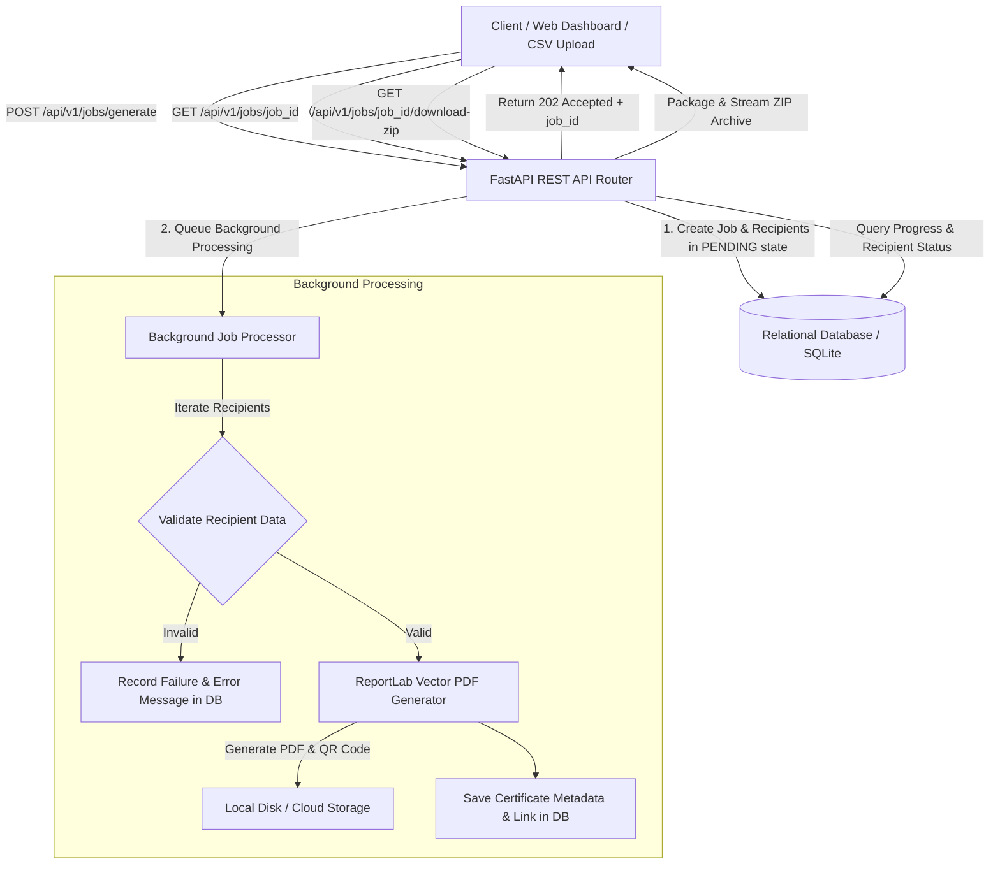

# 📜 Bulk Certificate Generator Engine

[](https://www.python.org/)
[](https://fastapi.tiangolo.com/)
[](https://www.sqlalchemy.org/)
[](https://www.reportlab.com/)
[](LICENSE)

A high-performance, asynchronous REST API and Web Dashboard built with **Python**, **FastAPI**, **SQLAlchemy**, and **ReportLab** that accepts bulk certificate generation requests for large batches of recipients, validates data gracefully per recipient, generates high-resolution vector PDF certificates with embedded verification QR codes, and tracks real-time generation progress.

---

## 🌟 Key Features

1. **Bulk Asynchronous Processing**
   - Submit thousands of recipients via a single JSON payload or CSV file upload.
   - Non-blocking background worker processes batch jobs asynchronously without holding HTTP connections open.
   - Immediate `202 Accepted` response returning a tracking `job_id`.

2. **Isolated Validation & Resilient Failure Handling**
   - Individual recipient validation (validates recipient name length, email syntax, required fields).
   - **Fault Isolation**: A failure in rendering one recipient's certificate **never** halts or invalidates the rest of the batch.
   - Tracks itemized success and error messages per recipient.

3. **High-Quality Vector PDF Rendering & Verification QR Codes**
   - Built on `ReportLab` with vector graphics, custom decorative borders, seals, and typography.
   - 4 pre-configured visual themes: **Gold Classic**, **Indigo Modern**, **Emerald Honor**, and **Crimson Elite**.
   - Auto-generates a unique `certificate_code` (e.g. `CERT-9F2B-4A1C`) and embeds an authentic QR code linking directly to the verification endpoint.

4. **Real-Time Job Status Tracking & Bulk Retrieval**
   - Query job status (`PENDING`, `PROCESSING`, `COMPLETED`, `PARTIALLY_FAILED`, `FAILED`).
   - Download individual PDF certificates or a auto-generated `.zip` archive containing all successfully generated certificates in a batch.

5. **Public Certificate Verification Portal & Live Web Dashboard**
   - Built-in sleek dark-mode glassmorphism Dashboard UI at `/`.
   - Public verification API (`/api/v1/certificates/verify/{code}`) for verifying certificate authenticity.
   - Live interactive template previewer for testing custom recipient names and course titles.

---

## 🏗️ Architecture & Component Design



---

## 📁 Repository Structure

```
bulk_certificate_generator/
├── app/
│   ├── __init__.py
│   ├── main.py                  # FastAPI application entrypoint & static mounts
│   ├── config.py                # Environment configuration settings
│   ├── database.py              # SQLAlchemy engine & session setup
│   ├── models/                  # DB Models (GenerationJob, JobRecipient, Certificate)
│   ├── schemas/                 # Pydantic V2 Schemas for request/response validation
│   ├── api/                     # REST API routers (jobs, certificates, templates)
│   ├── services/                # Business logic (validator, generator, job_processor)
│   └── static/                  # Web Dashboard UI (index.html, style.css, app.js)
├── tests/                       # Complete Pytest suite (14 unit & integration tests)
│   ├── test_validation.py
│   ├── test_generator.py
│   ├── test_job_processor.py
│   ├── test_jobs_api.py
│   └── test_certificates_api.py
├── samples/                     # Sample payloads (sample_recipients.json, sample_recipients.csv)
├── requirements.txt
├── pytest.ini
└── README.md
```

---

## 🚀 Setup & Execution Guide

### Prerequisites
- **Python 3.10+** (Tested on Python 3.13)
- `pip` package manager

### 1. Clone & Environment Setup

```bash
# Clone the repository
git clone https://github.com/<YOUR_USERNAME>/bulk_certificate_generator.git
cd bulk_certificate_generator

# Create virtual environment
python -m venv venv

# Activate virtual environment
# On Windows (PowerShell):
.\venv\Scripts\Activate.ps1
# On Linux/macOS:
source venv/bin/activate

# Install dependencies
pip install -r requirements.txt
```

### 2. Run the Application

Start the development server using `uvicorn`:

```bash
uvicorn app.main:app --reload --port 8000
```

Access points:
- **Interactive Web Dashboard**: [http://localhost:8000/](http://localhost:8000/)
- **OpenAPI Swagger Docs**: [http://localhost:8000/docs](http://localhost:8000/docs)
- **ReDoc API Spec**: [http://localhost:8000/redoc](http://localhost:8000/redoc)

---

## 🧪 Running Tests

The repository includes a 100% passing automated test suite with 14 unit and integration tests covering job creation, recipient input validation, ReportLab PDF rendering, job status polling, partial failure isolation, and certificate verification.

Run tests with `pytest`:

```bash
pytest
```

Output:
```text
============================= test session starts =============================
collected 14 items

tests/test_certificates_api.py::test_verify_certificate_valid PASSED     [  7%]
tests/test_certificates_api.py::test_verify_certificate_invalid PASSED   [ 14%]
tests/test_certificates_api.py::test_download_certificate_pdf PASSED     [ 21%]
tests/test_generator.py::test_generate_certificate_pdf_creates_file PASSED [ 28%]
tests/test_job_processor.py::test_process_job_with_partial_failures PASSED [ 35%]
tests/test_jobs_api.py::test_create_job_json_api PASSED                  [ 42%]
tests/test_jobs_api.py::test_create_job_csv_upload_api PASSED            [ 50%]
tests/test_jobs_api.py::test_get_job_status_api PASSED                   [ 57%]
tests/test_jobs_api.py::test_list_jobs_api PASSED                        [ 64%]
tests/test_validation.py::test_validate_valid_recipient PASSED           [ 71%]
tests/test_validation.py::test_validate_missing_name PASSED              [ 78%]
tests/test_validation.py::test_validate_short_name PASSED                [ 85%]
tests/test_validation.py::test_validate_invalid_email PASSED             [ 92%]
tests/test_validation.py::test_validate_optional_email_none PASSED       [100%]

======================= 14 passed in 0.97s =======================
```

---

## 📖 API Documentation & Example Usage

### 1. Submit Bulk Certificate Generation Request (JSON)

**Endpoint:** `POST /api/v1/jobs/generate`

**cURL Request:**
```bash
curl -X 'POST' \
  'http://localhost:8000/api/v1/jobs/generate' \
  -H 'Content-Type: application/json' \
  -d '{
  "title": "Full-Stack Web Development Bootcamp",
  "issuer_name": "Global Tech Institute",
  "issue_date": "2026-10-09",
  "template_theme": "gold",
  "recipients": [
    { "name": "Alexander Wright", "email": "alex@example.com" },
    { "name": "Elena Rostova", "email": "elena@example.com" },
    { "name": "", "email": "invalid-recipient@test.com" }
  ]
}'
```

**Response (`202 Accepted`):**
```json
{
  "id": "7f8c92a1-3b4e-412f-90a1-2b3c4d5e6f7a",
  "title": "Full-Stack Web Development Bootcamp",
  "issuer_name": "Global Tech Institute",
  "issue_date": "2026-10-09",
  "template_theme": "gold",
  "status": "PENDING",
  "progress": {
    "total": 3,
    "processed": 0,
    "successful": 0,
    "failed": 0,
    "percentage": 0.0
  },
  "created_at": "2026-10-09T21:00:00Z"
}
```

---

### 2. Submit Bulk Generation Request via CSV Upload

**Endpoint:** `POST /api/v1/jobs/upload-csv`

```bash
curl -X 'POST' \
  'http://localhost:8000/api/v1/jobs/upload-csv' \
  -F 'file=@samples/sample_recipients.csv' \
  -F 'title=Cloud Computing Masterclass' \
  -F 'issuer_name=Tech Academy' \
  -F 'issue_date=2026-10-09' \
  -F 'template_theme=emerald'
```

---

### 3. Check Job Status & Real-Time Progress

**Endpoint:** `GET /api/v1/jobs/{job_id}`

```bash
curl -X 'GET' 'http://localhost:8000/api/v1/jobs/7f8c92a1-3b4e-412f-90a1-2b3c4d5e6f7a'
```

**Response:**
```json
{
  "id": "7f8c92a1-3b4e-412f-90a1-2b3c4d5e6f7a",
  "status": "PARTIALLY_FAILED",
  "progress": {
    "total": 3,
    "processed": 3,
    "successful": 2,
    "failed": 1,
    "percentage": 100.0
  },
  "recipients": [
    {
      "id": "rec-1",
      "name": "Alexander Wright",
      "status": "SUCCESS",
      "certificate_code": "CERT-9F2B-4A1C",
      "error_message": null
    },
    {
      "id": "rec-3",
      "name": "",
      "status": "FAILED",
      "certificate_code": null,
      "error_message": "Recipient name is required and cannot be blank."
    }
  ],
  "download_zip_url": "/api/v1/jobs/7f8c92a1-3b4e-412f-90a1-2b3c4d5e6f7a/download-zip"
}
```

---

### 4. Download All Certificates as ZIP Archive

**Endpoint:** `GET /api/v1/jobs/{job_id}/download-zip`

Streams a compressed `.zip` archive containing all successfully generated PDF certificates for the specified job.

---

### 5. Verify Certificate Authenticity

**Endpoint:** `GET /api/v1/certificates/verify/{certificate_code}`

**cURL Request:**
```bash
curl -X 'GET' 'http://localhost:8000/api/v1/certificates/verify/CERT-9F2B-4A1C'
```

**Response:**
```json
{
  "is_valid": true,
  "certificate_code": "CERT-9F2B-4A1C",
  "recipient_name": "Alexander Wright",
  "course_title": "Full-Stack Web Development Bootcamp",
  "issuer_name": "Global Tech Institute",
  "issue_date": "2026-10-09",
  "download_url": "/api/v1/certificates/cert-uuid/download",
  "message": "Certificate is authentic and verified."
}
```

---

## 🧠 Technical Design & Trade-off Decisions

### 1. Synchronous vs Asynchronous Background Processing
- **Decision**: Implemented FastAPI `BackgroundTasks` execution worker with per-recipient database commit loops.
- **Reasoning**: PDF rendering (calculating vector bounding boxes, rasterizing QR codes, rendering PDF canvas) takes ~30ms–100ms per document. Processing 500 recipients synchronously in an HTTP request would result in a 15–50 second request hang, causing API timeouts. Asynchronous background tasks allow instant HTTP `202 Accepted` response while clients poll the lightweight `/jobs/{job_id}` status endpoint or receive updates.
- **Production Scalability**: The database schema and background worker are decoupled using standard SQLAlchemy sessions, enabling seamless transition to Distributed Task Queues (such as **Celery** or **Redis RQ**) for multi-node worker clusters.

### 2. Validation & Partial Failure Resilience Strategy
- **Decision**: Recipient validation and PDF generation are wrapped in a granular per-recipient `try...except` block inside the worker loop.
- **Reasoning**: In enterprise applications, a batch request containing 1,000 recipients shouldn't fail completely if recipient #499 has a missing name or malformed email. Invalid items are flagged as `FAILED` with specific error details, while valid items complete successfully, resulting in a `PARTIALLY_FAILED` job status.

### 3. Relational Database & ORM Selection
- **Decision**: Used **SQLAlchemy 2.0 ORM** with SQLite as default zero-config storage.
- **Reasoning**: SQLite provides zero-dependency local setup for assessment and testing, while SQLAlchemy ORM abstracts SQL dialects, enabling one-line configuration migration to **PostgreSQL** or **MySQL** in production environments.

---

## 🎯 Interview Q&A Defense Guide

If questioned during the recruitment technical interview, reference these core architectural points:

1. **Q: How does your application handle large batch sizes without exhausting memory?**
   - *Answer*: PDFs are rendered individually to file storage and database session objects are committed per recipient/batch. The ZIP endpoint streams files using Python's `zipfile` module without holding all binary buffers in RAM simultaneously.

2. **Q: Why did you choose FastAPI over Flask or Django?**
   - *Answer*: FastAPI provides native asynchronous capabilities, automatic OpenAPI documentation, high performance (built on Starlette & Pydantic), and clean dependency injection (`get_db`).

3. **Q: How would you scale this to 100,000 certificates per hour?**
   - *Answer*: 
     1. Replace FastAPI in-process background tasks with **Celery / Redis** distributed worker nodes.
     2. Move SQLite to a managed **PostgreSQL** instance with connection pooling (pgBouncer).
     3. Save generated PDF files to **Amazon S3** or **Google Cloud Storage** instead of local disk storage.
     4. Generate certificates in parallel worker pools.

---

## 📌 Pushing to GitHub Repository

To push this completed project to your GitHub repository for recruitment evaluation:

```bash
# Initialize git repository (if not already initialized)
git init

# Add files
git add .

# Commit
git commit -m "feat: complete bulk certificate generator backend assignment with tests & dashboard"

# Add your remote repository URL
git remote add origin https://github.com/<YOUR_USERNAME>/bulk_certificate_generator.git

# Push to GitHub
git branch -M main
git push -u origin main
```

---

## 📄 License
This project is licensed under the MIT License.
